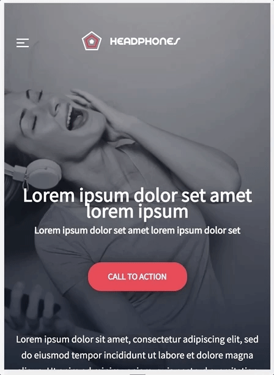

# Atlas-Headphones

This project is an implementation of the website from scratch, without a library. Only HTML/CSS/Accessibility/Responsive design knowledge has been used. The webpage has been designed by Nicolas Philippot, and the [figma prototype](https://www.figma.com/file/FfnVADRC9xgI3yiZliTBYZ/Holberton-School---Headphone-company?node-id=0%3A149&mode=dev) was used as a reference.


## Directory Structure 📚

```
atlas-headphones/
| -- index.html
| -- images/
|   | -- ...
| -- styles.css
| -- README.md
```

## Header/Hero 📢

The header section includes a logo and the block of three navigation links. The hero section consists of two blocks: one with a heading, text, and a button, and another with a block of text. There is an image in the background.

### Desktop version:


### Mobile version:




## "What we do..." 🧵

The section contains a header, a descriptive block of text and four applicable items arranged in a row, each with an icon and a text.

### Desktop version:


### Tablet version:


### Mobile version:


## "Our results" 📈

The section contains a heading, a block of text and four images featuring percentage of successful results.

### Desktop version:


### Tablet version:


### Mobile version:


## Contact us 📮

The contact section is asking for the user's name, email and the message.

### Desktop version:


### Tablet version:


### Mobile version:


## Footer 🎯

The footer section includes a block with an image and another block with images linked to social media, along with additional text.

## End product 🏆

### Desktop version:


### Mobile version:


## Tools/Frameworks used 📖
- HTML/CSS
- Figma

## Author/Contact info :phone: :mailbox:

* **Svitlana Pavlovska** **|** [Github](https://github.com/SvitLanaPavl) **|** [LinkedIn](https://www.linkedin.com/in/svitlana-pavlovska-833b43184/) **|** [Email](mailto:lanapavlovska90@gmail.com)
##


